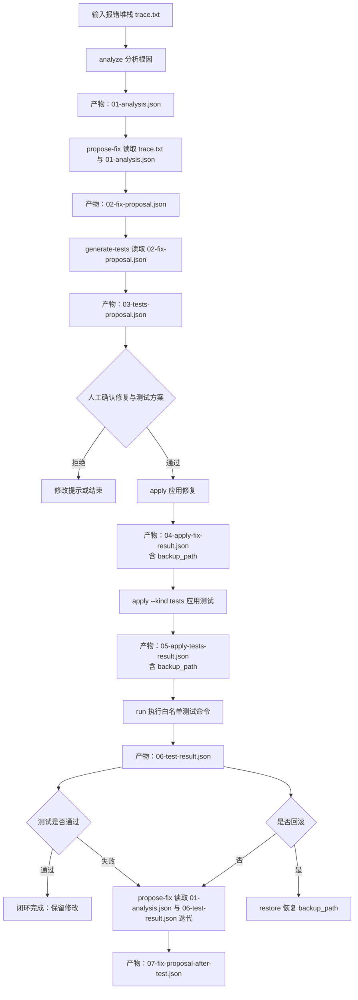

# bughunter

把一段报错堆栈交给大模型，让它**自主检索本地代码**后，给出「问题根因（含代码解释）+ 优化建议」的结构化结论。

- **零第三方依赖**：仅用 Python 3 标准库，内网可直接拷贝运行。
- **自写极简工具循环**：约 120 行 function-calling 循环，源码全在项目内、可随意修改，不当 pip 黑盒。
- **支持多种大模型**：走 OpenAI 兼容协议，切换 DeepSeek、通义千问、内网自托管模型只改 `base_url + model`。
- **可替换 LLM 实现**：用 `Protocol` 做防腐层，底层可整体替换而不动核心逻辑。
- **默认只读沙箱**：检索限制在仓库目录内；仅显式调用 `run_command()` 时执行白名单命令。

## 快速开始

安装（零第三方依赖，仅用标准库）：

```bash
pip install -e .          # 可安装方式（推荐）
# 或者直接把 bughunter/ 目录拷进项目 / 加入 PYTHONPATH
```

```python
from bughunter import analyze, Settings

result = analyze(
    stack_trace,
    repo_path="/path/to/repo",
    settings=Settings(base_url="http://10.0.0.5:8000/v1", model="qwen2.5-coder"),
)
print(result.summary)
print(result.root_cause)
```

也可通过环境变量配置后用命令行：

```bash
export BUGHUNTER_BASE_URL=http://10.0.0.5:8000/v1
export BUGHUNTER_MODEL=qwen2.5-coder

python -m bughunter --repo /path/to/repo --stack-file trace.txt
```

## 命令行用法

`bughunter` 保留旧式入口，也提供可串联的子命令入口。旧式入口默认输出 Markdown，适合快速看结论：

```bash
python -m bughunter --repo /path/to/repo --stack-file trace.txt
python -m bughunter --repo /path/to/repo --stack-file trace.txt --format json
```

可串联入口默认输出 JSON，适合把每个阶段的产物落盘后人工确认，并把上一阶段产物显式传给下一阶段：

```bash
# 1. 分析报错，产物：AnalysisResult JSON
python -m bughunter analyze \
    --repo /path/to/repo \
    --stack-file trace.txt \
    > 01-analysis.json

# 2. 生成修复方案，产物：FixProposal JSON
python -m bughunter propose-fix \
    --repo /path/to/repo \
    --stack-file trace.txt \
    --analysis 01-analysis.json \
    > 02-fix-proposal.json

# 3. 基于修复方案生成测试方案，产物：TestProposal JSON
python -m bughunter generate-tests \
    --repo /path/to/repo \
    --proposal 02-fix-proposal.json \
    > 03-tests-proposal.json

# 4. 人工确认 02-fix-proposal.json 后应用业务修复，产物：ApplyResult JSON
python -m bughunter apply \
    --repo /path/to/repo \
    --proposal 02-fix-proposal.json \
    > 04-apply-fix-result.json

# 5. 人工确认 03-tests-proposal.json 后应用测试代码，产物：ApplyResult JSON
#    注意：03-tests-proposal.json 不是给 run 直接使用的，必须先 apply --kind tests。
python -m bughunter apply \
    --repo /path/to/repo \
    --proposal 03-tests-proposal.json \
    --kind tests \
    > 05-apply-tests-result.json

# 6. 执行白名单命令，产物：CommandResult JSON
export BUGHUNTER_ALLOWED_COMMANDS='{"test":["python","-m","unittest"]}'
python -m bughunter run \
    --repo /path/to/repo \
    --name test \
    > 06-test-result.json

# 7. 如果测试失败，可把上一轮测试输出继续传回修复阶段迭代
python -m bughunter propose-fix \
    --repo /path/to/repo \
    --stack-file trace.txt \
    --analysis 01-analysis.json \
    --test-output 06-test-result.json \
    > 07-fix-proposal-after-test.json
```

也可以安装后使用脚本入口：

```bash
bughunter analyze --repo /path/to/repo --stack-file trace.txt > 01-analysis.json
bughunter propose-fix --repo /path/to/repo --stack-file trace.txt --analysis 01-analysis.json > 02-fix-proposal.json
bughunter generate-tests --repo /path/to/repo --proposal 02-fix-proposal.json > 03-tests-proposal.json
bughunter apply --repo /path/to/repo --proposal 02-fix-proposal.json > 04-apply-fix-result.json
bughunter apply --repo /path/to/repo --proposal 03-tests-proposal.json --kind tests > 05-apply-tests-result.json
bughunter run --repo /path/to/repo --name test > 06-test-result.json
```

关键产物消费关系：

| 产物 | 下一步如何使用 | 说明 |
| --- | --- | --- |
| `01-analysis.json` | `propose-fix --analysis 01-analysis.json` | 把根因分析作为生成修复方案的上下文。 |
| `02-fix-proposal.json` | `generate-tests --proposal 02-fix-proposal.json` | 基于修复方案生成回归测试方案。 |
| `02-fix-proposal.json` | `apply --proposal 02-fix-proposal.json` | 人工确认后应用业务修复。 |
| `03-tests-proposal.json` | `apply --proposal 03-tests-proposal.json --kind tests` | 人工确认后应用测试代码；这是 `03-tests-proposal.json` 的主要后续消费方式。 |
| `04-apply-fix-result.json` / `05-apply-tests-result.json` | `restore --backup-path <backup_path>` | 需要回滚时，使用产物中的 `backup_path` 恢复。 |
| `06-test-result.json` | `propose-fix --test-output 06-test-result.json` | 测试失败时，把上一轮测试输出传回修复阶段继续迭代。 |

如果只想把「应用测试代码」和「运行测试命令」合并成一步，且业务修复已经应用，也可以直接消费 `03-tests-proposal.json`：

```bash
python -m bughunter apply-and-test \
    --repo /path/to/repo \
    --proposal 03-tests-proposal.json \
    --kind tests \
    --name test \
    > 05-apply-tests-and-run-result.json
```

常用参数：

| 参数 | 适用命令 | 说明 |
| --- | --- | --- |
| `--repo` | 全部命令 | 目标代码仓库根目录。 |
| `--stack-file` | `analyze` / `propose-fix` / 旧式入口 | 报错堆栈文件；省略时从标准输入读取。 |
| `--format md\|json` | 旧式入口 | 旧式入口输出格式，默认 `md`。 |
| `--analysis` | `propose-fix` | 上一阶段 `analyze` 产出的 `AnalysisResult` JSON 文件。 |
| `--test-output` | `propose-fix` | 上一轮 `run` 产出的结果文件或原始测试输出，用于失败后迭代修复。 |
| `--proposal` | `generate-tests` / `apply` / `apply-and-test` | 上一阶段产出的 `FixProposal` 或 `TestProposal` JSON 文件。 |
| `--kind fix\|tests` | `generate-tests` / `apply` / `apply-and-test` | 指定 proposal 类型，默认 `fix`；应用测试方案时使用 `tests`。 |
| `--name` | `run` / `apply-and-test` | 要执行的白名单命令名，例如 `test`。 |
| `--backup-path` | `restore` | `apply` / `apply-and-test` 产物中的备份路径。 |
| `--max-steps` | `analyze` / `propose-fix` / `generate-tests` / 旧式入口 | 工具循环最大轮数，默认 `12`。 |
| `--max-retries` | LLM 相关命令 | LLM 调用失败重试次数，默认 `3`。 |
| `--base-url` / `--model` / `--api-key` | LLM 相关命令 | 覆盖环境变量；`--base-url` 与 `--model` 需同时提供。 |

相关环境变量：

| 环境变量 | 说明 |
| --- | --- |
| `BUGHUNTER_BASE_URL` | OpenAI 兼容端点，给到 `/v1` 这一层。 |
| `BUGHUNTER_MODEL` | 模型名。 |
| `BUGHUNTER_API_KEY` | API Key；内网无鉴权时可留空。 |
| `BUGHUNTER_TIMEOUT` | LLM 请求超时秒数，默认 `60`。 |
| `BUGHUNTER_MAX_RETRIES` | LLM 调用失败重试次数，默认 `3`。 |
| `BUGHUNTER_ALLOWED_COMMANDS` | 白名单命令 JSON 对象，例如 `{"test":["python","-m","unittest"]}`。 |
| `BUGHUNTER_COMMAND_TIMEOUT` | 命令执行超时秒数，默认 `300`。 |
| `BUGHUNTER_SYSTEM_CONTEXT` | 生成测试方案时传给模型的系统上下文。 |

当前 CLI 直接支持 `analyze`、`propose-fix`、`generate-tests`、`apply`、`run`、`apply-and-test`、`restore` 子命令。例如按 `04-apply-fix-result.json` 中的 `backup_path` 回滚：

```bash
python -m bughunter restore \
    --repo /path/to/repo \
    --backup-path .bughunter_backups/20260618-010203-000000
```

## 运行测试

```bash
python -m unittest discover -s tests
```

全部测试纯本地、零网络。

## 文档

- [设计文档](docs/design.md)：架构、工具循环机制、防腐层、安全沙箱、选型说明。
- [使用文档](docs/usage.md)：配置、模块调用、命令行、切换模型、内网部署。

## 闭环能力

除现有 `analyze()` 外，`bughunter` 还提供「修复 - 应用 - 测试」闭环接口：

- `propose_fix()`：只读检索代码，返回 `FixProposal`，不落盘。
- `generate_tests()`：只读检索代码，返回 `TestProposal`，不落盘。
- `apply_edits()`：在人工确认后确定性应用修改，带沙箱校验、备份和失败回滚。
- `restore_backup()`：按 `apply_edits()` 返回的备份路径恢复文件，并清理本次新建文件。
- `run_command()`：只执行 `Settings.allowed_commands` 中声明的白名单命令。
- `apply_and_test()`：组合执行 `apply_edits()` 与白名单测试命令。

流程编排由调用方系统负责：库只返回结构化结果，不做人工确认、不直接交互。

### 全流程串联



每个阶段的产物如下：

| 阶段 | 入口 | 主要产物 | 产物用途 |
| --- | --- | --- | --- |
| 输入 | 人工准备 | `trace.txt` | 保存报错堆栈，作为分析和修复提案的输入。 |
| 根因分析 | `python -m bughunter analyze` / `analyze()` | `AnalysisResult`；建议落盘为 `01-analysis.json` | 说明问题摘要、根因、相关代码位置、优化建议和置信度。 |
| 修复提案 | `python -m bughunter propose-fix --analysis 01-analysis.json` / `propose_fix()` | `FixProposal`；建议落盘为 `02-fix-proposal.json` | 读取报错堆栈和上一阶段分析结果，保存待人工确认的文件修改块、修改原因、摘要和置信度；不会写盘。 |
| 测试提案 | `python -m bughunter generate-tests --proposal 02-fix-proposal.json` / `generate_tests()` | `TestProposal`；建议落盘为 `03-tests-proposal.json` | 读取修复方案，生成覆盖关键路径的测试文件修改方案；不会写盘。 |
| 人工确认 | 调用方流程 | 已确认的 `02-fix-proposal.json` 与 `03-tests-proposal.json` | 人工确认后才进入写盘阶段；库本身不做交互式确认。 |
| 应用修复 | `python -m bughunter apply --proposal 02-fix-proposal.json` / `apply_edits()` | `ApplyResult`；建议落盘为 `04-apply-fix-result.json` | 记录已应用文件、跳过项和 `backup_path`；写入失败会尝试回滚。 |
| 应用测试 | `python -m bughunter apply --proposal 03-tests-proposal.json --kind tests` / `apply_edits()` | `ApplyResult`；建议落盘为 `05-apply-tests-result.json` | 记录测试文件的应用结果和 `backup_path`。 |
| 测试执行 | `python -m bughunter run --name test` / `run_command()` | `CommandResult`；建议落盘为 `06-test-result.json` | 记录白名单命令名、退出码、是否超时、stdout 和 stderr。 |
| 失败后迭代 | `python -m bughunter propose-fix --analysis 01-analysis.json --test-output 06-test-result.json` / `propose_fix()` | 新的 `FixProposal`；建议落盘为 `07-fix-proposal-after-test.json` | 把上一轮测试输出作为上下文，生成下一轮修复方案。 |
| 回滚 | `python -m bughunter restore --backup-path <backup_path>` / `restore_backup()` | 恢复后的工作区 | 按 `ApplyResult.backup_path` 恢复被修改文件，并清理本次新增文件。 |
| 一步应用并测试 | `python -m bughunter apply-and-test --proposal 02-fix-proposal.json --name test` / `apply_and_test()` | `ApplyAndTestResult` | 组合 `ApplyResult` 与 `CommandResult`，适合调用方已有人工确认环节后直接执行。 |

## 要求

Python 3.10 及以上（`pyproject.toml` 已声明 `requires-python >= 3.10`）。

## 参考来源

- CLI 子命令与参数：[bughunter/cli.py](bughunter/cli.py)
- 环境变量与白名单命令配置：[bughunter/config.py](bughunter/config.py)
- 应用、回滚与应用后测试接口：[bughunter/patch.py](bughunter/patch.py)
- 对外暴露的 Python API：[bughunter/__init__.py](bughunter/__init__.py)
- 项目 Python 版本要求：[pyproject.toml](pyproject.toml)
